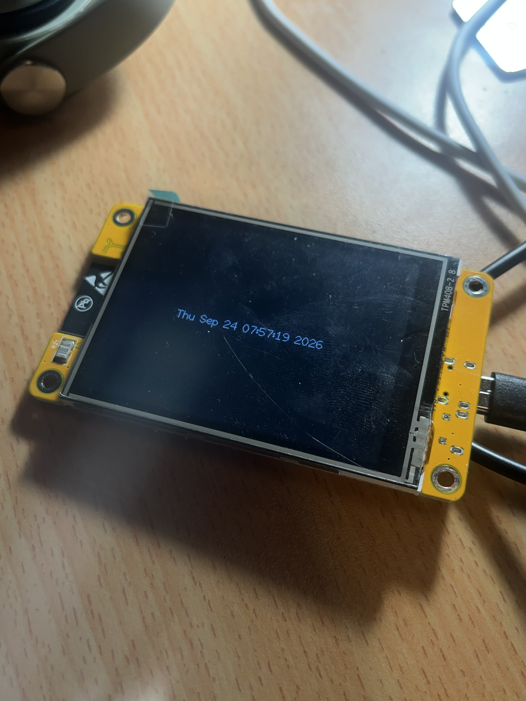

# ESP32-Time-Display

This project makes your esp32 with an lcd display on it tell the time, the code contains comments so it's totally configurable to your own timezone. Time is obtained via NTP so you will need to input your networks ssid and password to run the code successfully. 

